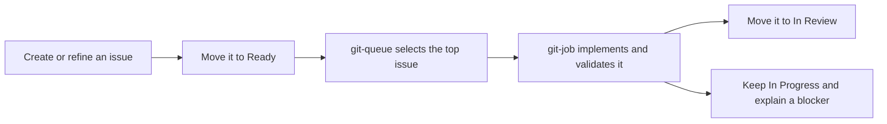

<!--
  AI Git Task Processing Skills
  Author: Bohdan Kossak
  X: https://x.com/BohdanDJA
  License: MIT
-->

<div align="center">
  <h1>AI Git Task Processing Skills</h1>
  <p><strong>Turn a GitHub Project Ready queue into a careful, repeatable implementation workflow for Claude Code and Codex.</strong></p>
  <p>
    <a href="https://github.com/AgencyAI-one/ai-git-task-processing-skills/actions/workflows/validate.yml"></a>
    <a href="LICENSE"></a>
  </p>
</div>

This small open-source toolkit gives Claude Code and Codex two shared skills:

- `git-queue` watches a GitHub Projects v2 board and selects the first open issue in the `Ready` status.
- `git-job` investigates that issue, implements it, runs the relevant checks, reports the outcome, and moves completed work to `In Review`.

Tasks are processed one at a time and in the same top-to-bottom order you set in GitHub Projects.

> Want to create and organize tasks by voice first? Pair these skills with [Git Master](https://github.com/AgencyAI-one/GIT_Master), an open-source voice-first GitHub issue and project manager. Dictate an issue in Git Master, move it to `Ready`, and let this queue workflow take it from there.

## How it works



The queue skill never implements multiple issues at once. The job skill never selects the next issue. Keeping those responsibilities separate makes the behavior easier to understand and control.

## Requirements

- A Linux or macOS shell with Bash
- [Git](https://git-scm.com/)
- [GitHub CLI](https://cli.github.com/) (`gh`)
- [jq](https://jqlang.github.io/jq/)
- A GitHub Projects v2 board with a `Status` field
- [Claude Code](https://code.claude.com/docs/en/overview) or [Codex](https://developers.openai.com/codex)
- Permission to read issues and update the target repository and project

The repository follows the official project-skill locations for [Claude Code](https://code.claude.com/docs/en/skills) and [Codex](https://developers.openai.com/codex/skills).

## Quick start

### 1. Install the skills into your project

Clone this repository, then run its installer with the path to the repository where the agent will work:

```bash
git clone https://github.com/AgencyAI-one/ai-git-task-processing-skills.git
cd ai-git-task-processing-skills
./scripts/install.sh /path/to/your-project
```

The installer adds:

```text
your-project/
├── .agents/skills/       # Codex
│   ├── git-job/SKILL.md
│   └── git-queue/SKILL.md
├── .claude/skills/       # Claude Code
│   ├── git-job/SKILL.md
│   └── git-queue/SKILL.md
└── scripts/
    └── git-wait-ready-task.sh
```

Existing files are never overwritten unless you explicitly pass `--force`:

```bash
./scripts/install.sh --force /path/to/your-project
```

Commit the installed files in the target repository so every local agent session can discover them.

### 2. Authenticate GitHub CLI

```bash
gh auth login
gh auth refresh -s project
gh auth status
```

Use the least-privileged GitHub account and token that can access the intended repository and project. Organization projects may require organization approval.

### 3. Find the project number

The project number is not the project ID. List projects owned by your user or organization:

```bash
gh project list --owner YOUR_GITHUB_OWNER
```

Example output:

```text
NUMBER  TITLE
3       Development
```

You can inspect its fields and exact status option names with:

```bash
gh project field-list 3 --owner YOUR_GITHUB_OWNER --format json
```

### 4. Configure the session

Run these commands in the same terminal where you will start Claude Code or Codex:

```bash
export PROJECT_OWNER="YOUR_GITHUB_OWNER"
export PROJECT_NUMBER="3"
export READY_STATUS="Ready"
export IN_PROGRESS_STATUS="In Progress"
export IN_REVIEW_STATUS="In Review"
export POLL_SECONDS="20"
export TASK_COMMENT_LANGUAGE="English"
```

Only `PROJECT_OWNER` and `PROJECT_NUMBER` are required. The other values shown are defaults, except `TASK_COMMENT_LANGUAGE`: when it is unset, the job uses the issue's language and falls back to English.

### 5. Test the queue connection

From the target project root, run:

```bash
./scripts/git-wait-ready-task.sh
```

If a matching issue exists, the command prints its URL and exits. If the queue is empty, it keeps checking at the configured interval. Press `Ctrl+C` to stop the test.

### 6. Start the agent

Start your preferred CLI from the target project root.

For Claude Code:

```bash
claude
```

Then invoke:

```text
/git-queue
```

For Codex:

```bash
codex
```

Then invoke:

```text
$git-queue
```

Leave the session running. The poller waits when the queue is empty, and the agent starts the next issue only after the current issue is ready for review or has been documented as blocked.

## Process one issue without the queue

You can run the job skill directly with a GitHub issue URL.

Claude Code:

```text
/git-job https://github.com/OWNER/REPOSITORY/issues/123
```

Codex:

```text
$git-job https://github.com/OWNER/REPOSITORY/issues/123
```

This is useful for testing the workflow before enabling continuous queue processing.

## Configuration

| Variable | Required | Default | Purpose |
| --- | --- | --- | --- |
| `PROJECT_OWNER` | Yes | — | GitHub user or organization that owns the project |
| `PROJECT_NUMBER` | Yes | — | GitHub Projects v2 number |
| `READY_STATUS` | No | `Ready` | Status searched by the queue poller |
| `IN_PROGRESS_STATUS` | No | `In Progress` | Status used when implementation starts |
| `IN_REVIEW_STATUS` | No | `In Review` | Status used after successful validation |
| `POLL_SECONDS` | No | `20` | Positive polling interval in seconds |
| `TASK_COMMENT_LANGUAGE` | No | Issue language | Language used for final and blocker comments |

Status names should match your GitHub Project options exactly.

## Using it with Git Master

[Git Master](https://github.com/AgencyAI-one/GIT_Master) and these skills cover complementary parts of the workflow:

1. Use voice, text, screenshots, and attachments in Git Master to create a complete GitHub issue.
2. Review the issue and place it in your project's `Ready` status.
3. `git-queue` detects the highest-priority ready issue.
4. `git-job` implements and validates it in the code repository.
5. Review the resulting branch or pull request when the issue reaches `In Review`.

Git Master is optional; issues created directly in GitHub work exactly the same way.

## Safety and operating model

These skills can modify source code, create commits and pull requests, comment on issues, and update project statuses. Review the skill files before using them and begin with the normal permission mode of your agent CLI.

For unattended operation, configure narrowly scoped permissions for a trusted repository and account. Avoid broad permission-bypass modes on machines or repositories that contain unrelated credentials, private data, or production access.

The workflow deliberately:

- handles one issue at a time;
- scopes project updates to `PROJECT_OWNER` and `PROJECT_NUMBER`;
- preserves unrelated worktree changes;
- moves an issue to review only after the main work is complete and validated;
- leaves blocked work in progress and explains what is needed;
- ignores closed issues, draft project items, and pull-request cards in the Ready queue.

## Troubleshooting

### The skill does not appear

Confirm that you started the CLI from the target repository and that the skill exists in `.claude/skills` or `.agents/skills`. If those top-level directories were created after the session started, restart the CLI.

### GitHub CLI reports a scope error

Refresh the project scope and verify the active account:

```bash
gh auth refresh -s project
gh auth status
```

Also confirm that the account can access the target repository and organization project.

### The poller finds no issue

Check all four items:

1. `PROJECT_OWNER` is the login that owns the project, not necessarily the repository owner.
2. `PROJECT_NUMBER` is the number shown by `gh project list`.
3. `READY_STATUS` exactly matches a Status option.
4. The project item is an open GitHub issue, not a draft issue or pull request.

### Work remains in progress

That is expected when the agent finds a blocker, cannot validate the implementation, or encounters failing required checks. Read the issue comment for the exact action needed before continuing.

## Repository layout

```text
.
├── .agents/skills/       # Codex-compatible skill copies
├── .claude/skills/       # Claude Code-compatible skill copies
├── .github/workflows/    # Public repository validation
├── scripts/              # Installer, poller, and validation tools
├── tests/                # Poller behavior tests
├── CONTRIBUTING.md
├── LICENSE
├── SECURITY.md
└── README.md
```

The Claude Code and Codex copies are intentionally identical. Run the validation script after changing either copy.

## Development and validation

```bash
./scripts/validate.sh
```

This checks Bash syntax, validates the skill frontmatter, confirms both agent copies match, runs ShellCheck when available, and exercises the poller with mocked GitHub responses.

## Contributing

Issues and pull requests are welcome. Read [CONTRIBUTING.md](CONTRIBUTING.md) before submitting a change. Please report sensitive problems according to [SECURITY.md](SECURITY.md).

## Author

Created and maintained by Bohdan Kossak — [@BohdanDJA on X](https://x.com/BohdanDJA).

## License

Released under the [MIT License](LICENSE).

Claude, Claude Code, Codex, GitHub, and X are trademarks of their respective owners. This project is independent and is not endorsed by Anthropic, OpenAI, GitHub, or X.
