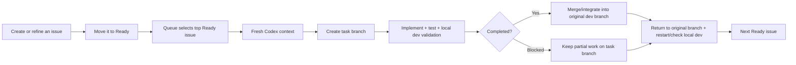

<!--
  AI Git Task Processing Skills
  Author: Bohdan Kossak
  X: https://x.com/BohdanDJA
  License: MIT
-->

<div align="center">
  <h1>AI Git Task Processing Skills</h1>
  <p><strong>Turn a GitHub Project Ready queue into a careful, repeatable implementation workflow for Claude Code and Codex.</strong></p>
  <p>
    <a href="https://github.com/AgencyAI-one/ai-git-task-processing-skills/actions/workflows/validate.yml"></a>
    <a href="LICENSE"></a>
  </p>
</div>

This open-source toolkit gives Claude Code and Codex two shared skills plus a Codex queue runner:

- `git-queue` watches a GitHub Projects v2 board and selects the first open issue in the `Ready` status.
- `git-job` executes one issue end to end on an isolated task branch, validates it, integrates completed work back into the branch that was active before the task, restores local development services, reports the result, and moves completed work to `In Review`.
- `scripts/codex-git-queue.sh` is the recommended long-running Codex mode. It starts a fresh ephemeral Codex context for every issue so context from previous tasks does not accumulate.

Tasks are processed one at a time and in the same top-to-bottom order you set in GitHub Projects.

> Want to create and organize tasks by voice first? Pair these skills with [Git Master](https://github.com/AgencyAI-one/GIT_Master), an open-source voice-first GitHub issue and project manager. Dictate an issue in Git Master, move it to `Ready`, and let this workflow take it from there.

## How it works



The queue layer selects work. The `git-job` skill executes exactly one selected issue. Keeping those responsibilities separate prevents one task from silently spilling into the next.

## Task branch lifecycle

For every issue, `git-job` treats the branch that was active before the task as the integration/base branch. For example, if you start the queue on `dev_01`, the expected lifecycle is:

```text
dev_01
  -> Ready issue #123
  -> fresh Codex context
  -> create/switch to ai/issue-123-short-slug
  -> implement + test + local dev validation
  -> completed: merge/integrate into dev_01
     blocked: keep partial work on task branch, do not merge
  -> switch back to dev_01
  -> restart/check local dev server when configured
  -> next issue starts from dev_01 in another fresh Codex context
```

Important behavior:

- new issue work should not be implemented directly on the development branch;
- completed and validated work returns to the branch that was active before the task;
- blocked or incomplete work stays isolated on its task branch and is not merged;
- the local checkout must return to the original branch before another issue starts;
- the queue stops instead of starting another issue if it cannot safely restore the original branch/worktree state;
- repository branch protection and PR-only policies are respected. If direct merge is not allowed, the job creates or updates the required PR instead of bypassing policy.

## Requirements

- Linux or macOS with Bash
- [Git](https://git-scm.com/)
- [GitHub CLI](https://cli.github.com/) (`gh`)
- [jq](https://jqlang.github.io/jq/)
- a GitHub Projects v2 board with a `Status` field
- [Claude Code](https://code.claude.com/docs/en/overview) or [Codex](https://developers.openai.com/codex)
- permission to read issues and update the target repository and project

The repository follows the official project-skill locations for Claude Code and Codex.

## Quick start

### 1. Install into your target repository

```bash
git clone https://github.com/AgencyAI-one/ai-git-task-processing-skills.git
cd ai-git-task-processing-skills
./scripts/install.sh /path/to/your-project
```

The installer adds:

```text
your-project/
├── .agents/skills/       # Codex
│   ├── git-job/SKILL.md
│   └── git-queue/SKILL.md
├── .claude/skills/       # Claude Code
│   ├── git-job/SKILL.md
│   └── git-queue/SKILL.md
└── scripts/
    ├── git-wait-ready-task.sh
    └── codex-git-queue.sh
```

Existing files are never overwritten unless you explicitly pass `--force`:

```bash
./scripts/install.sh --force /path/to/your-project
```

Commit the installed files in the target repository so local agent sessions can discover them.

### 2. Authenticate GitHub CLI

```bash
gh auth login
gh auth refresh -s project
gh auth status
```

Use the least-privileged GitHub account and token that can access the intended repository and project. Organization projects may require organization approval.

### 3. Find the GitHub Project number

The project number is not the project ID:

```bash
gh project list --owner YOUR_GITHUB_OWNER
```

Example:

```text
NUMBER  TITLE
3       Development
```

Inspect fields and exact status names with:

```bash
gh project field-list 3 --owner YOUR_GITHUB_OWNER --format json
```

### 4. Configure the queue

Run these in the same terminal from which the worker will be started:

```bash
export PROJECT_OWNER="YOUR_GITHUB_OWNER"
export PROJECT_NUMBER="3"
export READY_STATUS="Ready"
export IN_PROGRESS_STATUS="In Progress"
export IN_REVIEW_STATUS="In Review"
export POLL_SECONDS="20"
export TASK_COMMENT_LANGUAGE="English"


export DEV_SERVER_RESTART_COMMAND='pm2 restart my-app' 
export DEV_SERVER_CHECK_COMMAND='curl -f http://localhost:3000'
export CODEX_QUEUE_MAX_TASKS=1 
./scripts/codex-git-queue.sh
```

Only `PROJECT_OWNER` and `PROJECT_NUMBER` are required. The other queue/status values shown above are defaults except `TASK_COMMENT_LANGUAGE`, which otherwise follows the issue language and falls back to English.

### 5. Optional: configure the local development server

For web projects, define an explicit safe command for restarting or starting the local development server after branch changes:

```bash
export DEV_SERVER_RESTART_COMMAND='YOUR_REPOSITORY_SPECIFIC_RESTART_COMMAND'
```

Optionally define a readiness/smoke command:

```bash
export DEV_SERVER_CHECK_COMMAND='YOUR_REPOSITORY_SPECIFIC_CHECK_COMMAND'
```

Examples depend on the target repository. Prefer its existing scripts, process manager, Docker Compose setup, Make target, or documented development command. The skill deliberately does not guess a port and kill arbitrary processes.

If reliable hot reload already follows checked-out files and no restart is necessary, you can leave these variables unset.

### 6. Test the queue connection

From the target repository root:

```bash
./scripts/git-wait-ready-task.sh
```

If a matching issue exists, the command prints its URL and exits. If the queue is empty, it keeps polling. Press `Ctrl+C` to stop the test.

## Recommended Codex mode: fresh context for every task

Start from the development branch that should receive completed work. For example:

```bash
git switch dev_01
./scripts/codex-git-queue.sh
```

This is the recommended way to run a long-lived Codex worker.

The runner repeatedly:

1. records the currently checked-out branch as the base branch for the next task;
2. waits for the first Ready issue;
3. starts a new `codex exec --ephemeral` invocation;
4. explicitly invokes `$git-job <ISSUE_URL>`;
5. passes the original branch through `GIT_JOB_BASE_BRANCH`;
6. verifies that the repository returns to that original branch after the task;
7. refuses to continue if branch/worktree restoration is unsafe;
8. starts the next issue in another fresh Codex context.

It intentionally does not use `codex exec resume`, so previous issue conversation context is not reused.

You can keep it visible in `tmux`:

```bash
tmux new -s codex-worker
./scripts/codex-git-queue.sh
```

Detach with your normal tmux key sequence and reconnect later with:

```bash
tmux attach -t codex-worker
```

### Codex runner options

| Variable | Required | Default | Purpose |
| --- | --- | --- | --- |
| `CODEX_SANDBOX` | No | `workspace-write` | Sandbox passed to `codex exec` |
| `CODEX_NETWORK_ACCESS` | No | `true` | Network access for `workspace-write` sandbox |
| `CODEX_PROFILE` | No | — | Optional Codex CLI profile |
| `CODEX_RETRY_SECONDS` | No | `10` | Delay after a failed Codex invocation |
| `CODEX_QUEUE_MAX_TASKS` | No | `0` | Stop after N tasks; `0` means continuous |

For a one-task test of the runner:

```bash
export CODEX_QUEUE_MAX_TASKS=1
./scripts/codex-git-queue.sh
```

## Interactive queue mode

You can still use the skills directly inside an interactive CLI session.

Claude Code:

```bash
claude
```

then:

```text
/git-queue
```

Codex:

```bash
codex
```

then:

```text
$git-queue
```

This mode keeps the queue inside one interactive conversation. It is convenient for supervised operation, but conversation context can accumulate across issues. For unattended or long-running Codex queues, prefer `./scripts/codex-git-queue.sh`.

## Process one issue manually

Claude Code:

```text
/git-job https://github.com/OWNER/REPOSITORY/issues/123
```

Codex:

```text
$git-job https://github.com/OWNER/REPOSITORY/issues/123
```

`git-job` records the current branch before starting, creates/reuses a dedicated issue branch, performs the work, and returns to the recorded branch when it finishes or documents a blocker.

## Configuration reference

| Variable | Required | Default | Purpose |
| --- | --- | --- | --- |
| `PROJECT_OWNER` | Yes | — | GitHub user or organization that owns the Project |
| `PROJECT_NUMBER` | Yes | — | GitHub Projects v2 number |
| `READY_STATUS` | No | `Ready` | Status searched by the queue poller |
| `IN_PROGRESS_STATUS` | No | `In Progress` | Status used when implementation starts |
| `IN_REVIEW_STATUS` | No | `In Review` | Status used after successful validation/integration |
| `POLL_SECONDS` | No | `20` | Positive polling interval in seconds |
| `TASK_COMMENT_LANGUAGE` | No | Issue language | Language used for final/blocker comments |
| `GIT_JOB_BASE_BRANCH` | No | Current branch | Integration branch for one job; normally set by the Codex runner |
| `TASK_BRANCH_PREFIX` | No | `ai/issue-` | Prefix for task branches |
| `DEV_SERVER_RESTART_COMMAND` | No | — | Safe repository-specific local dev restart/start command |
| `DEV_SERVER_CHECK_COMMAND` | No | — | Optional local dev readiness/smoke command |

Status names must match the GitHub Project options exactly.

## Using it with Git Master

[Git Master](https://github.com/AgencyAI-one/GIT_Master) and these skills cover complementary parts of the workflow:

1. Use voice, text, screenshots, and attachments in Git Master to create a complete GitHub issue.
2. Review the issue and place it in your project's `Ready` status.
3. The queue detects the highest-priority Ready issue.
4. A fresh Codex context starts for that issue when using `codex-git-queue.sh`.
5. `git-job` creates a task branch, implements and validates the issue, and integrates completed work back into the original development branch.
6. Review the result when the issue reaches `In Review`.

Git Master is optional; issues created directly in GitHub work the same way.

## Safety and operating model

These skills can modify source code, create branches and commits, create or update pull requests, comment on issues, merge completed work when repository policy allows it, restart explicitly configured development services, and update project statuses.

The workflow deliberately:

- handles one issue at a time;
- scopes project updates to `PROJECT_OWNER` and `PROJECT_NUMBER`;
- creates an isolated task branch for new issue work;
- preserves unrelated worktree changes;
- does not merge incomplete or blocked task work into the development branch;
- returns the checkout to the pre-task branch before the next issue;
- moves an issue to review only after the main work is complete and validated;
- leaves blocked work in progress and explains what is needed;
- ignores closed issues, draft project items, and pull-request cards in the Ready queue;
- respects repository PR requirements and branch protection instead of bypassing them.

For unattended operation, use narrowly scoped permissions for a trusted repository and account. Avoid broad permission-bypass modes on machines or repositories that contain unrelated credentials, private data, or production access.

## Troubleshooting

### The skill does not appear

Confirm that you started the CLI from the target repository and that the skill exists in `.claude/skills` or `.agents/skills`. If those directories were added after the session started, restart the CLI.

### GitHub CLI reports a scope error

```bash
gh auth refresh -s project
gh auth status
```

Also confirm that the account can access the target repository and organization project.

### The poller finds no issue

Check that:

1. `PROJECT_OWNER` owns the GitHub Project;
2. `PROJECT_NUMBER` is the number shown by `gh project list`;
3. `READY_STATUS` exactly matches a Status option;
4. the Project item is an open GitHub issue, not a draft issue or pull request.

### The queue stops after a task

The fresh-context runner intentionally stops if it cannot safely return to the branch/worktree state expected for the next task. Inspect:

```bash
git status
git branch --show-current
```

Resolve the unexpected state, return to the intended development branch, then start the runner again.

### Work remains In Progress

That is expected when the agent finds a blocker, cannot validate the implementation, cannot safely integrate the result, or cannot restore required local development state. Read the issue comment for the task branch and exact action needed to continue.

## Repository layout

```text
.
├── .agents/skills/       # Codex-compatible skill copies
├── .claude/skills/       # Claude Code-compatible skill copies
├── .github/workflows/    # Public repository validation
├── scripts/
│   ├── install.sh
│   ├── validate.sh
│   ├── git-wait-ready-task.sh
│   └── codex-git-queue.sh
├── tests/                # Poller and Codex runner behavior tests
├── CONTRIBUTING.md
├── LICENSE
├── SECURITY.md
└── README.md
```

The Claude Code and Codex skill copies are intentionally kept identical. Run validation after changing either copy.

## Development and validation

```bash
./scripts/validate.sh
```

This checks Bash syntax, validates skill frontmatter, confirms the Claude/Codex skill copies match, runs ShellCheck when available, exercises the Ready poller, and tests the fresh-context Codex runner with mocked commands.

## Contributing

Issues and pull requests are welcome. Read [CONTRIBUTING.md](CONTRIBUTING.md) before submitting a change. Please report sensitive problems according to [SECURITY.md](SECURITY.md).

## Author

Created and maintained by Bohdan Kossak — [@BohdanDJA on X](https://x.com/BohdanDJA).

## License

Released under the [MIT License](LICENSE).

Claude, Claude Code, Codex, GitHub, and X are trademarks of their respective owners. This project is independent and is not endorsed by Anthropic, OpenAI, GitHub, or X.
